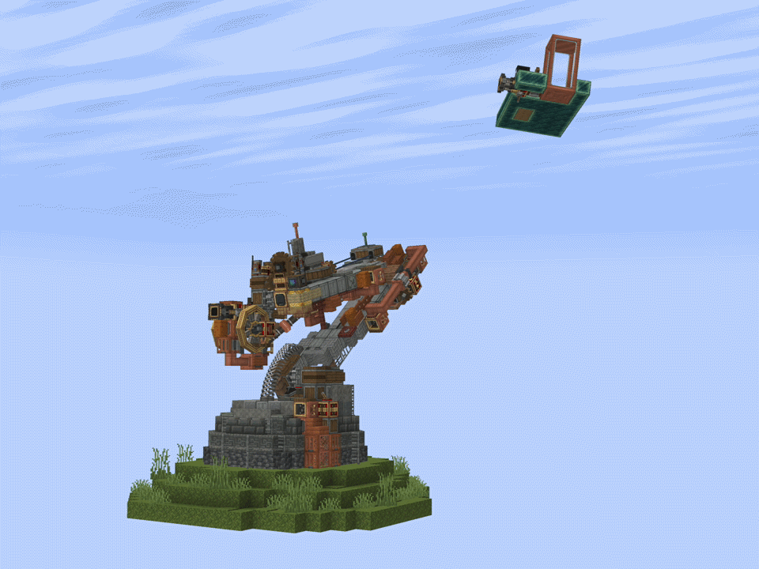

# 4-DOF-Manipulator-C-A-CC
This is a project that implements a 4 DOF Manipulator in Minecraft using **Create Aeronautics** and **CC: Tweaked**.



### Installation
To download, copy the following commands into your Minecraft computer terminal: 

```bash
pastebin run V6Vae0RM
```

This project includes LuaMatrix (http://luamatrix.luaforge.net/),
which is licensed under the MIT License.

